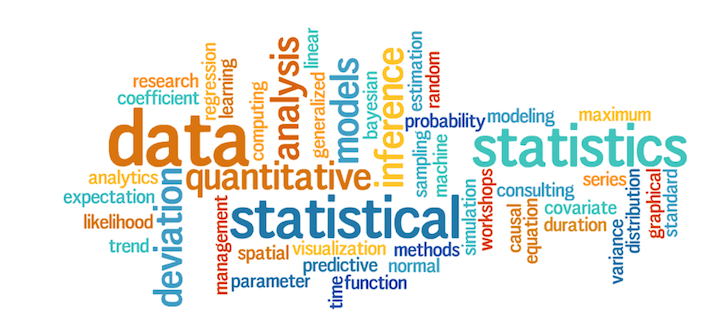
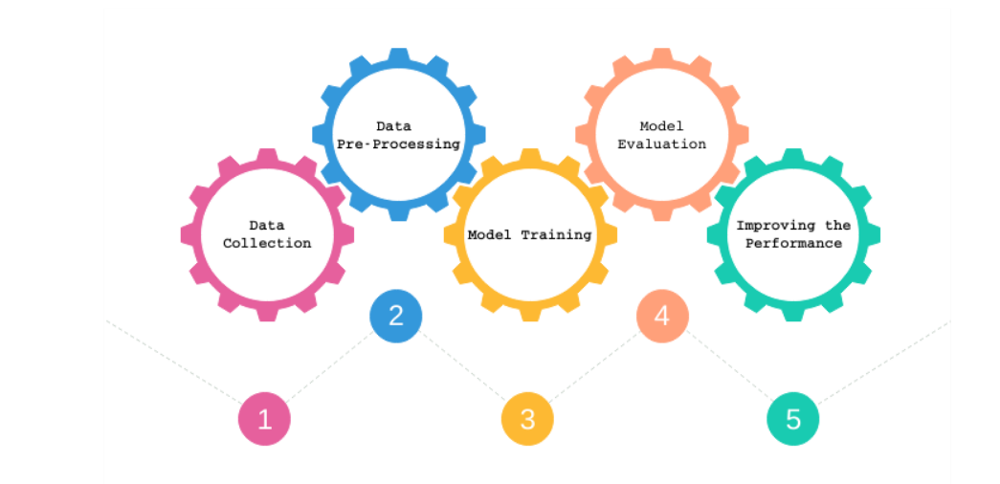

# MachineLearningUsingPython

  
Machine Learning is a latest __buzzword__ floating around. It desrves to, as it is one of the most interesting subfield of Computer Science. 
__What does Machine Learning really means?__ 
Machine Learning is an application of artificial intelligence(AI) that provides systems the ability  to automatically learn and improve from experience without being explicitly programmed. 
__Machine Learning focuses on the development of computer programs__ that can access data and use it to learn for themsleves. 
The process of learning begins with data, such as, direct experience, or instruction, in order to look for patterns in data and make better decisions in the future based on the examples that we provide. __The primary aim is to allow the computers learn automatically__ without human intervention or assistance and adjust actions accordingly.
  

## Repository Overview
This repository includes all my Data Science and Machine Learning academic projects till date.

## Table of Contents
[1. EDA](#section1) 
        -[1.1 Bus Bookings](#section101) 
        -[1.2 IPL](#section102)  
[2. ML](#section2) 
        -[2.1 House Price Prediction](#section201) 
        -[2.2 Train Passenger Volume](#section202) 
        -[2.3 Songs Views Prediction](#section203) 
        -[2.4 Video Views Prediction](#section204) 
        -[2.5 Server Hack Prediction](#section204) 

___

### [1. EDA](./EDA)

### [1.1 Bus Bookings](./EDA/Bus%20Bookings)
  
- Bus travel these days, is gaining popularity as the most preferred mode of travel with better roads, comfortable
buses, high flight rates and ease of access to tickets. Proliferation of internet, rising income, online bus ticket
search and booking, growth in low cost carriers, have further added to the growth of online travel market in India.
- Here is the project which does analysis on bus ticket bookings in certain range of time.
- [Link for the Jupyter notebook](./EDA/Bus%20Bookings/Bookings.ipynb)

___

#### [1.2 IPL](./EDA/IPL)
  
- The Indian Premier League (IPL) is a professional Twenty20 cricket league in India contested during March or April and May of every year by eight teams representing eight different cities in India. The league was founded by the Board of Control for Cricket in India (BCCI) in 2008. The IPL has an exclusive window in ICC Future Tours Programme. 
- All Indian Premier League Cricket matches data between 2008 and 2018. Data contains details related to the match such as location, contesting teams, umpires, results, etc.
- [Link for the Jupyter notebook](./EDA/IPL/IPL_DATA_EDA.ipynb)

___

### [2. ML](./ML)

#### [2.1 House Price Prediction](./ML/House%20Price%20Prediction)
  
- There are a number of factors which determine property prices, some are logical, based on economic theories and population density and some are based on more intangible factors, like availability of amenities & necessities, neighborhood, etc.
- Build a multiple regression models(Linear Regression, Decision Trees, Random Forest ) to predict the price of the property from the dataset having attributes such as sale type, sale condition etc.
- [Link for the Jupyter notebook](./ML/House%20Price%20Prediction/House_Price_Prediction%20.ipynb)

___

#### [2.2 Train Passenger Volume](./ML/Train%20Passenger%20Volume)
  
- Railway passenger volume forecast is an important basis of passenger traffic organization, it is also the base to set railway market policies of passenger transportation.
- Here we are trying to predict passenger volume over time.
- [Link for the Jupyter notebook](./ML/Train%20Passenger%20Volume/TrainPassengerVolume.ipynb)

___

#### [2.3 Songs Views Prediction](./ML/Songs%20Views%20Prediction)
  
- One of our customers strongly believes in technology and has recently backed up its platform using Machine Learning and Artificial Intelligence. Based on data collected from multiple sources on different songs and various artist attributes our customer is excited to challenge the MachineHack community.
-By analyzing the chartbusters data to predict the Views of songs, MachineHackers would advance the state of the current platform. This can help our customer understand user behaviour and personalize the user experience. 
In this hackathon, we challenge the MachineHackers to come up with a prediction algorithm that can predict the views for a given song.
- Here we are trying to predict how popular a song will be in the future.
- [Link for the Jupyter notebook](./ML/Songs%20Views%20Prediction/ChartBustersParticipants.ipynb)

#### [2.4 Video Views Prediction](./ML/Video%20Views%20Prediction)
  
- Here we are trying to predict how popular a song will be in the future.
- [Link for the Jupyter notebook](./ML/Video%20Views%20Prediction/VideoViewsPrediction.ipynb)

#### [2.5 Server Hack Prediction](./ML/Server%20Hack%20Prediction)
  
- All the countries across the globe have adapted to means of digital payments. And with the increased volume of digital payments, hacking has become a pretty common event wherein the hacker can try to hack your details just with your phone number linked to your bank account. However, there is data with some anonymized variables based on which one can predict that the hack is going to happen. 
Your work is to build a predictive model which can identify a pattern in these variables and suggest that a hack is going to happen so that the cyber security can somehow stop it before it actually happens. You have to predict the column : "MALICIOUS_OFFENSE".
- [Link for the Jupyter notebook v1](./ML/Server%20Hack%20Prediction/v1/ServerHackPrediction_v1.ipynb)
- [Link for the Jupyter notebook v2](./ML/Server%20Hack%20Prediction/v2/ServerHackPrediction_v2.ipynb)

## Projects in execution

